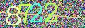

---
author:
  - name: Julio Trecenti
    affiliation: IME-USP, Curso-R
    address: >
      1010 Rua do Matao
    email: \email{julio.trecenti@gmail.com}
    url: http://jtrecenti.com
  - name: Daniel Falbel
    affiliation: Curso-R
  - name: Caio Lente
    affiliation: IME-USP, Curso-R
  - name: Victor Fossaluza
    affiliation: IME-USP
title:
  formatted: "\\pkg{decryptr} - Solving Captchas in R"
  plain:     "decryptr - Solving Captchas in R"
  short:     "\\pkg{decryptr} - Solving Captchas in R"
abstract: >
  Captcha (Completely Automated Public Turing test to tell Computers and Humans Apart) are images that can be easily read by humans, but hard to interpret by machines. In this work we present the \pkg{decryptr} package which provides a complete and flexible framework to download, generate, model and solve text based Captchas in \proglang{R}. We describe the package main functionalities and use cases. We present an overview of the statistical learning techniques used to solve Captchas and describe how to create a customized model using convolutional neural networks.
keywords:
  formatted: [keras, convolutional neural networks, captcha, "\\proglang{R}"]
  plain:     [keras, convolutional neural networks, captcha, R]
preamble: >
  \usepackage{amsmath}
  \usepackage{lipsum}
  \usepackage{float}
  \usepackage{booktabs}
classoption: nojss
vignette: >
  %\VignetteIndexEntry{decryptr - Solving Captchas in R}
  %\VignetteEncoding{UTF-8}
  %\VignetteEngine{knitr::rmarkdown}
output: rticles::jss_article
bibliography: bibliography.bib
editor_options: 
  chunk_output_type: inline
---

# Introduction

Captcha (Completely Automated Public Turing test to tell Computers and Humans Apart) is a technique used in many websites to prevent automated access. The simplest Captcha is an image containing random and distorted alphanumeric characters. Usually these images can be easily read by humans, but hard to interpret by machines. Scientists try to solve Captchas (i.e. take an image and return a text) as a way to test the performance of predictive models. 

Figure \ref{fig:captcha-example} represents a Captcha example. In mathematical notation, the image is a matrix $\mathbf X = \{x_{ijk}\}_{N\times M \times R}$, where $N$ is the number of lines, $M$ is the number of columns and $R$ is the number of *colors*, or *channels*, as we'll call from now on. We call the element $x_{nm\cdot} \in [0,1]$ a *pixel*, which is our observational unit. Figure \ref{fig:captcha-example} a coloured image with dimensions $(40\times120\times3)$ has 50,400 pixels, organized in three different channels. Our response variable is the Captcha label, which in this case is \code{8722}. The main task of a Captcha solver is to take an image $X$ as *input* and evaluate the correct label as *output*.

```{r captcha-example, fig.cap="Captcha example, extracted from Rio Grande do Sul State Court, in Brazil.", out.width="0.2\\textwidth", echo=FALSE, fig.pos="H"}

```

In this work present the \pkg{decryptr} package, which provides a complete and flexible framework to download, generate, fit models and solve text based Captchas in \proglang{R}. In Section \ref{framework} we describe the package main functionalities and use cases. In section \ref{fitted} we show the data used to fit models and the fitted models to all the Captchas that we are already able to solve. Finally, in Section \ref{custom} we present an overview of the statistical learning techniques used to solve Captchas and explain with examples how to describe and fit customized models.

## Scope

\pkg{decryptr} only solves text based Captchas. It is not designed to solve task based Captchas nor object detection based Captchas, like reCaptcha 2.0. \pkg{decryptr} can deal with any alphanumeric dictionary characters inside images with any length, including variable length Captchas.

\pkg{decryptr}'s models are fitted using Convolutional Neural Networks (CNN; \citealt{lecun1995convolutional}). CNNs are highly non linear supervised models that are used mainly to recognize objects in images and classify texts. We use the \pkg{keras} package \citep{kerasjj} to fit these models. In Section \ref{custom} we describe how to fit custom Captcha solvers using \pkg{keras} and \pkg{decryptr}.

## Software review

\lipsum[2]

## R software

\lipsum[2]

<!-- ----------------------------------------------------------------------- -->

# General framework {#framework}

\pkg{decryptr} aims to provide the \proglang{R} user with the ability to solve some specific text based Captchas. It also provides a flexible methodology to fit models for new Captchas, and use these models along with other helper functions of the package. Because of the consistency of the approach to solve new Captchas, \pkg{decryptr} can be seen as a general solution to them.

Actually, \pkg{decryptr} is more than an \proglang{R} package. It is a system that includes an *Application Programming Interface* (API), which can be used to download, solve Captchas and validate Captcha solvers. The API is public, and the documentation can be accessed in [https://decryptr.xyz/api](https://decryptr.xyz/api). The decryptr system is described in Figure \ref{fig:decryptr-system}.

```{r decryptr-system, out.width="0.5\\textwidth", fig.cap="The decryptr system. \\pkg{decryptr}, \\pkg{decryptrModels} and \\pkg{decryptrData} are \\proglang{R} packages, while \\pkg{decryptpy} is a \\proglang{python} module that mirrors \\pkg{decryptr}'s functionality, \\pkg{decryptrAPI} is an API to solve Captchas as a service, and \\pkg{decryptView} is a shiny app, used to classify Captchas manually and make annotations.", echo=FALSE, fig.pos="H"}
DiagrammeR::grViz("
digraph decryptr_system {
  labelloc='t';
  label='The decryptr System'
  graph [overlap = true, rankdir=LR]
  
  node [shape=circle, fixedsize=true, width=1.2, height=0.5, fontsize=12]
  decryptr; decryptrModels; decryptrAPI; decryptpy; decryptView
  
  decryptr -> decryptpy;
  decryptpy -> decryptr;
  decryptr -> decryptrAPI;
  decryptrModels -> decryptr;
  decrytprData -> decryptr;
  decryptr -> decryptView;
}
")

```


Figure \ref{fig:diagram} describes \pkg{decryptr}'s main functions in a visual flavor. The box-shaped nodes represent basic operations, like download, read, view and solve Captchas that already have fitted models. In contrast, the round-shaped nodes represent advanced operations, used mainly to fit a new model. The dashed nodes are functions from another packages (\code{plot()} from \pkg{base} and \code{fit_generator()} from \pkg{keras}), used to enhance the package functionality.

```{r diagram, echo=FALSE, out.width="0.5\\textwidth", fig.cap="Visual representation of the package."}
library(decryptr)
DiagrammeR::grViz("
digraph decryptr {
  graph [overlap = true]
  labelloc='t';
  label='The decryptr R Package'

  node [shape=box, fixedsize=true, width=1.4, height=0.5, fontsize=12]
  download_captcha; read_captcha; decrypt

  node [shape=circle, fixedsize=true, width=1, fontsize = 10]
  model_generator; model_specs; model_compile; classify;

  node [shape=circle, fixedsize=true, width=1, fontsize=10, style=dashed]
  fit_generator;
  
  node [shape=box, fixedsize=true, width=1, height=0.5, fontsize=12, style=dashed]
  plot;

  download_captcha -> read_captcha;
  read_captcha -> model_generator;
  read_captcha -> plot;
  model_generator -> plot;
  model_specs -> model_compile;
  model_compile -> fit_generator;
  model_generator -> fit_generator;
  fit_generator -> decrypt;
  read_captcha -> classify;
  read_captcha -> decrypt;
}
")
```

## Download Captchas from the web

The \code{download_captcha} function downloads an image from a specific URL. By default, the image is downloaded to the user's working directory. The option \code{n} can be used to control the number of Captchas to be downloaded. One can set some timeout and specify the file extension. By default, the extention is extracted from the MIME-type of the responde headers.

```{r eval=FALSE}
tmp <- tempdir()
u_cpt <- "https://www4.tjmg.jus.br/juridico/sf/captcha.svl"
download_captcha(url = u_cpt, n = 2, path = tmp)
```

    [1] "/tmp/Rtmp6L21cm/captcha1d31d0f4162.jpeg"                               
    [2] "/tmp/Rtmp6L21cm/captcha1d3166a667d3.jpeg"

Some Captchas have shorcuts, obtained through decryptr's public API. The available Captchas at the time this document was written are described in Table \ref{tab:avaliable-captchas}.

```{r avaliable-captchas, echo=FALSE}
tibble::tribble(
  ~Alias, ~Description,
  "tjmg", "Minas Gerais State Court",
  "tjrs", "Rio Grande do Sul State Court",
  "tjrj", "Rio de Janeiro State Court",
  "trt", "Rio de Janeiro Labor Court",
  "rfb", "Brazilian Federal Revenue Office") %>% 
  knitr::kable(caption = "Available shortcuts do download Captchas.", 
               format = "latex", align = c("c", "l"),
               booktabs = TRUE, linesep = "")
```

```{r eval=FALSE, echo=FALSE}
gen <- model_generator("path/to/folder", ...)
# easy way
m <- model_specs(n_conv = 3, n_channels = 64, ...)

# hard way
input <- keras::layer_input(...)
output <- input %>% 
  keras::layer_conv_2d(...) %>% 
  ... %>% 
  keras::layer_flatten() %>% 
  keras::layer_dense(...) %>% 
  ... %>% 
  keras::layer_activation()
m <- keras::keras_model(input, output)

# fit
keras::fit_generator(m, gen)
```

## Read Captchas from image files

The \code{read_captcha()} function loads image files into \proglang{R}. This enables the user to easily view Captchas using \code{plot()} function and is also an intermediate step to decrypt, classify and create generators, as described in Figure \ref{fig:diagram}. The result of \code{read_captcha()} is a list of \proglang{S3} class \code{captcha}

```{r eval=FALSE}
captcha_files <- download_captcha("tjrs", 2, tmp)
(captcha <- read_captcha(files))
```

    A list of 2 captchas located at:
    1. "/tmp/Rtmp6L21cm/captcha1d316785c15c.jpeg"
    2. "/tmp/Rtmp6L21cm/captcha1d311bb1a4bb.jpeg"

```{r plot-example, eval=FALSE}
plot(captcha)
```

```{r two-img, echo=FALSE, fig.cap="Plotting Captcha files read with \\code{read\\_captcha()}.", out.width="0.2\\textwidth", fig.pos="H"}

# ARRUMAR O PLOT PARA TER ESSE COMPORTAMENTO
m <- magick::image_read(c("captcha1d3113043efa.jpeg", 
                     "captcha1d316e586b08.jpeg")) %>% 
  magick::image_append(stack = TRUE)
par(mar=rep(0, 4))
plot(m)
```

When there are too many Captchas to view, \pkg{decryptr} limits the number of showed Captchas to 16, and asks the user to view the next 16. One can override this option by, say, 25 images, setting \code{options(decryptr.max.view = 25)} or \code{plot(captchas, n = 25)}.

## Predict values using decrypt

The \code{decrypt} function is the main operation of \pkg{decryptr}. Given one or more Captchas and a model, it returns the solution to the Captchas. 

The first argument can be either a character vector containing the paths to the Captchas or the object returned by the \code{read_captcha()} function. 

The second argument can be either an ajusted \pkg{keras} model returned by \code{load_model()} function or just the alias of the model. The difference of these approaches is that the latter must load the model every time the user makes a prediction, while the former loads the model just once.

```{r decrypt-example, eval=FALSE}
decrypt(captcha, "tjrs")
```

    [1] "7722"
    [2] "8722"

<!-- ----------------------------------------------------------------------- -->

# Fitted models {#fitted}

\pkg{decryptr} provides specialized models to specific Captcha types with high accuracy rate (above 95%). The fitted models are stored in \pkg{decryptrModels}, which must be installed to use inside \pkg{decryptr}. 

```{r load-model-example, eval = FALSE}
tjrs_model <- load_model("tjrs")
```

The model object is a list containing two elements: i) the complete dictionary of the possible characters inside a Captcha and ii) the fitted \code{keras} model used to make predictions. in \code{tjrs} example, these are

```{r model-labs-example, eval = FALSE}
tjrs_model$labs
```

    [1] "0" "1" "2" "3" "4" "5" "6" "7" "8" "9"

```{r model-spec-example, eval = FALSE}
tjrs_model$model
```

    Model
    _______________________________________________________________________
    Layer (type)                   Output Shape                 Param #    
    =======================================================================
    conv2d_4 (Conv2D)              (None, 40, 110, 4)           104        
    _______________________________________________________________________
    max_pooling2d_4 (MaxPooling2D) (None, 20, 55, 4)            0          
    _______________________________________________________________________
    conv2d_5 (Conv2D)              (None, 20, 55, 16)           1616       
    _______________________________________________________________________
    max_pooling2d_5 (MaxPooling2D) (None, 10, 27, 16)           0          
    _______________________________________________________________________
    conv2d_6 (Conv2D)              (None, 10, 27, 32)           12832      
    _______________________________________________________________________
    max_pooling2d_6 (MaxPooling2D) (None, 5, 13, 32)            0          
    _______________________________________________________________________
    flatten_2 (Flatten)            (None, 2080)                 0          
    _______________________________________________________________________
    dense_3 (Dense)                (None, 16)                   33296      
    _______________________________________________________________________
    dropout_2 (Dropout)            (None, 16)                   0          
    _______________________________________________________________________
    dense_4 (Dense)                (None, 50)                   850        
    _______________________________________________________________________
    reshape_2 (Reshape)            (None, 5, 10)                0          
    _______________________________________________________________________
    activation_2 (Activation)      (None, 5, 10)                0          
    =======================================================================
    Total params: 48,698
    Trainable params: 48,698
    Non-trainable params: 0
    _______________________________________________________________________

## Data

Unfortunately the data needed to fit Captcha solvers do not comply with CRAN package policies. The size of a complete dataset of images can sum up to a couple of Gigabytes. 

To overcome this limitation, we host the [https://decryptr.xyz/data](https://decryptr.xyz/data) site to store the Captcha raw images and provide the \code{download_captcha_data()} to help with the download step. This function downloads the compressed data from decryptr's site and decompresses it in a path specified by the user.

```{r download-data, eval = FALSE}
tmp <- tempdir()
download_captcha_data("rfb", tmp)
```

    [=================================================================>]  100 %
    
    Data were downloaded in "/tmp/Rtmp7grAD8"
    Use read_captcha() function to load the captchas into memory and
    use model_generator() to create a data generator.


## Trained model summary

The complete list of models and their accuracy rate are described in Table \ref{tab:model-summary}. The accuracy rate was calculated using *oracles*, which are functions that verify if the Captcha was solved by accessing the original site automatically, passing through the Captcha to access some content. Because the tests were made in production, the estimated accuracy rates are very reliable.

```{r model-summary, echo=FALSE}
tibble::tribble(
  ~Alias, ~`Train examples`, ~Accuracy,
  "rfb", 25000, "95%",
  "trt", 5000, "96%",
  "tjmg", 10000, "100%",
  "tjrs", 8000, "92%",
  "tjrj", 10000, "99%",
  "rsc", 5000, "98%",
  "cadesp", 2000, "92%",
  "nfesp", 40000, "88%",
  "sefaz_sp", 30000, "80%",
  "sintegra_rj", 5000, "80%"
) %>% 
  knitr::kable(format = "latex", booktabs = TRUE, linesep = "",
               caption = "decryptr available models.", 
               format.args = list(decimal.mark = ".", big.mark = ","), 
               align = c("c", "r", "r"))
```

In the future, more models will be added to this list, along with non-specialized models that try to generalize for new Captchas, but with lower accuracy rates.

<!-- ----------------------------------------------------------------------- -->

# Custom models {#custom}

\lipsum[2]

## Logistic regression

\lipsum[2]

## Dense layer

\lipsum[2]

### Activation

\lipsum[2]

## Convolutional layer

\lipsum[2]

### Max pooling

\lipsum[2]

## Example

\lipsum[2]

### Classify images manually

\lipsum[2]

### Shiny app

\lipsum[2]

<!-- ----------------------------------------------------------------------- -->

# Conclusion

\lipsum[2]

## Acknowledgement

\lipsum[2]

<!-- ## Code formatting -->
<!-- * \proglang{Java} -->
<!-- * \pkg{plyr} -->
<!-- * \code{print("abc")} -->


