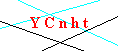

```{r setup, include=FALSE}
knitr::opts_chunk$set(echo = TRUE, eval=FALSE)
par(mar = rep(0, 4))
knitr::opts_knit$set(global.par = TRUE)
```

Neste tutorial, vamos mostrar como usar o `decryptr` para quebrar um captcha do `esaj`.

O captcha do `esaj` é dado na figura abaixo.

```{r echo=FALSE}

```

Primeiro, vamos carregar o `decryptr`

```{r}
library(decryptr)
```

É possível baixar imagens usando `decryptr::download()`. Por exemplo:

```{r eval=FALSE}
url_captcha <- 'http://esaj.tjsp.jus.br/cjsg/imagemCaptcha.do'
dest_dir <- '~/data-raw/decryptr/esaj'
download(url_captcha, dest = dest_dir, n = 10, type = 'png')
```

Você pode classificar manualmente seus captchas usando `decryptr::classify()`. Por exemplo:

```{r eval=FALSE}
dest_dir <- '~/data-raw/decryptr/esaj'
arqs <- dir(dest_dir, full.names = TRUE) %>% 
  read_captcha()

classify(arqs, dest = arqs)
```

Ao rodar essa função, você verá a imagem plotada na tela e poderá digitar a resposta:

```{r echo=FALSE}
'esajcaptcha.png' %>% 
  read_captcha() %>% 
  plot()
```

```
Answer: ycnht
```

A imagem classificada será salva como `esajcaptcha_ycnht.png`


```{r eval=FALSE, echo=FALSE}
devtools::load_all()
u0 <- 'http://esaj.tjsp.jus.br/cjsg/getArquivo.do?cdAcordao=10510490&cdForo=0'
u_img <- 'http://esaj.tjsp.jus.br/cjsg/imagemCaptcha.do'
u_som <- 'http://esaj.tjsp.jus.br/cjsg/somCaptcha.do'
download_one2 <- function(url, dest, secure = FALSE, type) {
  dest <- paste(dest, type, sep = '.')
  httr::GET(url, httr::config(ssl_verifypeer = secure),
            httr::write_disk(dest, overwrite = TRUE))
  dest
}
dir <- '~/data-raw/decryptr/esaj'
safe_decifrar <- purrr::possibly(captchaSajAudio::decifrar, 
                                 otherwise = NA_character_)
baixar_um <- function() {
  httr::GET(u0)
  dest <- tempfile(pattern = 'captcha', tmpdir = dir)
  download_one2(u_img, dest, type = 'png')
  download_one2(u_som, dest, type = 'mp3')
  s <- file.size(paste0(dest, '.mp3'))
  if (s < 100) {
    file.remove(paste0(dest, '.mp3'))
    file.remove(paste0(dest, '.png'))
  } else {
    classify(read_captcha(paste0(dest, '.png')), 
             dest = dir, 
             answer = safe_decifrar(paste0(dest, '.mp3')))
  }
  return(s)
}

for(i in 1:20000) {
  res <- baixar_um()
  while(res < 100) {
    Sys.sleep(5)
    res <- baixar_um()
  }
}
```

# Ajustando modelo

Nesse exemplo, pegamos xxx captchas classificados manualmente.

```{r}
dest_dir <- '~/data-raw/decryptr/esaj'

# listar todos os captchas classificados
classified_captchas <- dest_dir %>% 
  dir(full.names = TRUE, pattern = '_.*png$') %>% 
  magrittr::extract(file.size(.) > 0) %>% 
  sort() %>% 
  read_captcha()

head(basename(classified_captchas))
```

A função `decryptr::prepare()` lê todas as imagens

```{r eval=FALSE}
prepared_data <- prepare(classified_captchas)
str(prepared_data)
saveRDS(prepared_data, 'prepared_data.rds')
```

A função `decryptr::model()` cria um modelo automático para os dados.


### RFB MODEL

```{r}
prepared_data <- readRDS('prepared_data.rds')

set.seed(474747)
prop_test <- .05
n_tot <- nrow(prepared_data$y)
n_test <- round(nrow(prepared_data$y) * prop_test)
my_sample <- sample(seq_len(n_tot), n_tot - n_test, replace = FALSE)

x_train <- prepared_data$x[my_sample,,,, drop = FALSE]
y_train <- prepared_data$y[my_sample,,, drop = FALSE]

x_test <- prepared_data$x[-my_sample,,,, drop = FALSE]
y_test <- prepared_data$y[-my_sample,,, drop = FALSE]


library(keras)
# MODELO DO DANIEL WTF ---------------------------------------------------------
model <- keras_model_sequential()
model %>%
  layer_conv_2d(
    input_shape = dim(x_train)[-1],
    filters = 32,
    kernel_size = c(5,5),
    padding = "same",
    activation = "relu"
  ) %>%
  layer_max_pooling_2d() %>%
  layer_conv_2d(
    filters =  64,
    kernel_size = c(5,5),
    padding = "same",
    activation = "relu"
  ) %>%
  layer_max_pooling_2d() %>%
  layer_conv_2d(
    filters =  128,
    kernel_size = c(5,5),
    padding = "same",
    activation = "relu"
  ) %>%
  layer_max_pooling_2d() %>%
  layer_flatten() %>%
  layer_dense(units = 128) %>%
  layer_dense(units = prod(dim(y_train)[-1])) %>%
  layer_reshape(target_shape = dim(y_train)[-1]) %>%
  layer_activation("softmax")

# compile-----------------------------------------------------------------------
model %>%
  compile(
    optimizer = "adam",
    loss = "categorical_crossentropy",
    metrics = "accuracy"
  )

# fit---------------------------------------------------------------------------
# model <- load_model_hdf5('~/decryptr/decryptrModels/inst/keras/esaj.hdf5')
model %>%
  fit(
    x = x_train,
    y = y_train,
    batch_size = 200,
    epochs = 100,
    shuffle = TRUE,
    validation_data = list(x_test, y_test)
  )

save_model_hdf5(model, '~/decryptr/decryptrModels/inst/keras/esaj.hdf5')
```


```{r eval=FALSE}
devtools::load_all()
prepared_data <- readRDS('prepared_data2.rds')

# n <- dim(prepared_data$y)[1]
# n_sample <- 18000
# ids <- sample(seq_len(n), n_sample, replace = FALSE)

# res <- apply(prepared_data$x, c(1, 2, 3), mean)
# prepared_data$x[,,,1] <- res
# prepared_data$x[,,,2] <- res
# prepared_data$x[,,,3] <- res
# saveRDS(prepared_data, 'prepared_data2.rds')

set.seed(19910409)
keras_model <- model(prepared_data = prepared_data, 
                     epochs = 10, 
                     prop_test = .20, 
                     drop_out = .3, 
                     n_filters = 3,
                     window_size = 3, 
                     pooling_size = 2)

keras::save_model_hdf5(model, '../inst/model_esaj.hdf5')
saveRDS(keras_model, '../inst/model_esaj.rds')
```

Finalmente, use a função `predict()` para predizer o resultado.

```{r eval=FALSE}
predict(keras_model, arq = read_captcha('esajcaptcha.png'))
## ycnht
```

```{r}
url_captcha <- 'http://esaj.tjsp.jus.br/cjsg/imagemCaptcha.do'
dest_dir <- '~/data-raw/decryptr/esaj'
me <- download(url_captcha, dest = dest_dir, n = 1, type = 'png')
me %>% 
  read_captcha() %>% 
  plot()
predict(keras_model, arq = read_captcha(me))
```

